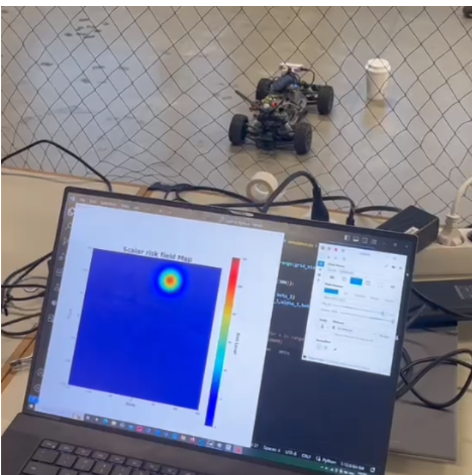
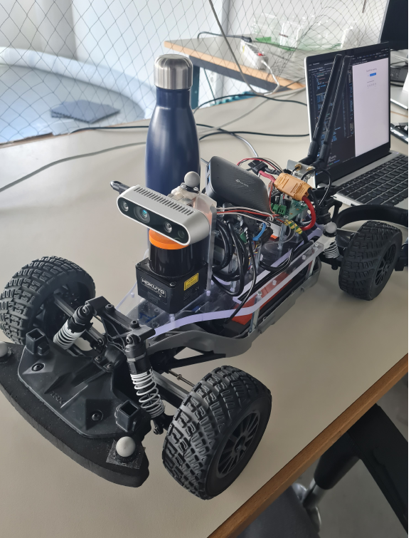

# Risk Field Simulation

Real-time generation of a scalar risk field around a vehicle, built from live LIDAR data on an F1tenth car and visualized with Pygame and Matplotlib. This was a Year 1 project for the TU/e Honors Academy. The idea comes from the shared risk field concept in autonomous driving research: instead of tracking individual obstacles, the vehicle builds a continuous 2D field where higher values mark regions that are more dangerous to enter.

The car carries a Hokuyo UST-10LX LIDAR with a 270 degree field of view and around 10 meter range. Each scan is converted from polar to Cartesian coordinates, filtered, and reduced to the nearest obstacles. From those obstacles the code computes a scalar risk field over a grid, where the risk of each cell is the summation of collision threat contributions from the detected objects. The heavy grid math is compiled with Numba so the field can be recomputed and redrawn fast enough to track the environment in real time.

## Results

The system runs against the physical F1tenth car and renders the risk field live as the car moves and obstacles appear in front of it. Below, an obstacle in the LIDAR's view shows up as a hot spot on the scalar risk field map.

<p align="center">
  
</p>

<p align="center">
  
  <br>
  <em>F1tenth car with the Hokuyo UST-10LX LIDAR and onboard compute.</em>
</p>

Getting reliable output took real tuning. The raw LIDAR data was noisy, so a median filter was added to smooth the ranges before object detection. Shiny surfaces produced spurious distance readings, which was handled by calibrating the sensor's intensity threshold to drop unreliable returns.

## Files

- `vector.py`: a `Vector` class for 2D vector operations.
- `obs_finder.py`: parses a LIDAR scan, converts it to Cartesian coordinates, and extracts the nearest obstacles.
- `risk_field.py`: the risk field math (safe distance, alpha/beta/delta terms, per-cell risk), with the grid calculation compiled by Numba.
- `gui.py`: Matplotlib visualization of the risk field.
- `gui2.py`: faster Pygame visualization of the scalar risk field map.
- `network.py`: socket configuration and connection handling for talking to the car.
- `server.py`: main entry point for the live setup; receives data from the car and runs the detection and risk field pipeline.
- `simulation.py`: standalone simulation for testing the risk field calculation and display without the car, with cProfile timing.
- `simulation2_numba.py`: Numba-optimized version of the simulation for faster calculation.

## Requirements

- Python 3.x
- NumPy, Matplotlib, Pygame, Numba

## Installation

```sh
git clone https://github.com/danieltyukov/tue-risk-field-honors.git
cd tue-risk-field-honors
pip install numpy matplotlib pygame numba
```

## Usage

Live, with the car in the lab: set the network IP address in `server.py` and on the car, then run the server.

```sh
python server.py
```

Standalone, without the car, to test and profile the risk field calculation:

```sh
python simulation.py           # baseline
python simulation2_numba.py    # Numba-optimized
```

Both simulation scripts write cProfile output to `profiling_results`, which is how the performance work was measured.
